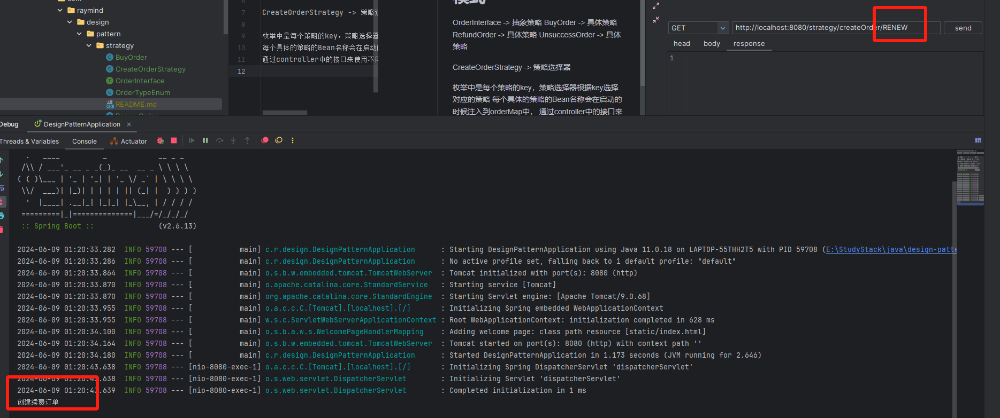
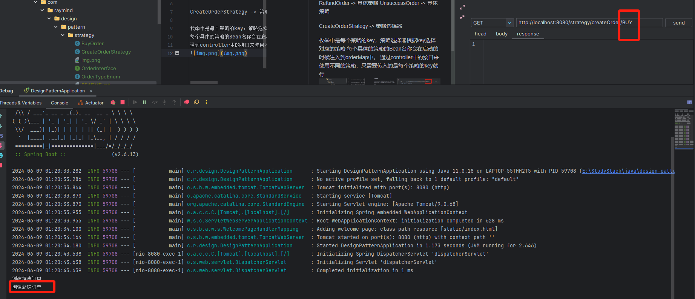

# 使用map优雅实现策略模式
OrderInterface -> 抽象策略
BuyOrder -> 具体策略
RefundOrder -> 具体策略
UnsuccessOrder -> 具体策略

CreateOrderStrategy -> 策略选择器

枚举中是每个策略的key，策略选择器根据key选择对应的策略
每个具体的策略的Bean名称会在启动的时候注入到orderMap中，
通过controller中的接口来使用不同的策略，只需要传入的是每个策略的key就行

